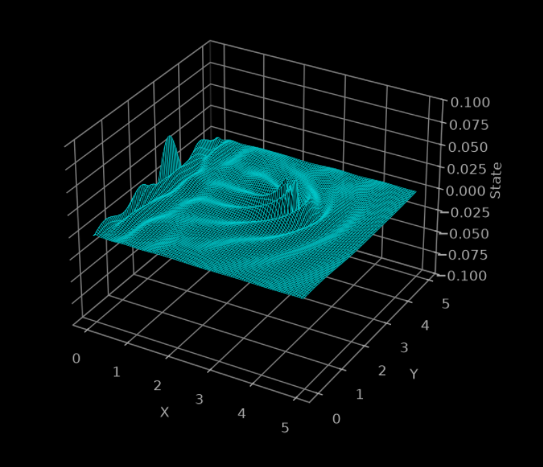

# Tempest

## Introduction

Tempest is a computational framework for simulating and studying PDE-based systems.

However, it did not start out with this vision. I'm writing this to gain insight into the evolution of Tempest since its inception and what I've learnt along the way.

## The beginning

At the end of my first year, I grew fascinated with Numerical Weather Prediction. The fact that even state of the art models hit a hard mathematical wall beyond 10-14 days really got me thinking about this field. The chaotic nature of the atmosphere was almost entrancing and too interesting to ignore.

So, there I was. An 18-year old trying to build an entire NWP model. I quickly realised I had to start small. Very small. The first commit was literally just the 1D linear advection with Euler integration.

## Initial Design

The entire code was, and still is, written in Python from scratch using NumPy with a simple Matplotlib dashboard.

## Learning numerical methods

I evolved the project incrementally, adding one PDE, integration method, boundary condition at a time. 

I learnt what "finite-difference" actually meant, how boundary conditions work using ghost cells, how a PDE is actually mapped to a grid, and a lot of foundations for grid-based numerical solvers.

## Validation

Then one day I though: "Wait a minute, how do I know my simulations are correct?". That led me down the rabbit hole of validation and convergence studies.

Automated data generation, validation studies, convergence plots, boundary mismatch, numerical error.

It was a steep learning curve to actually implement analytical solutions and learn where that error term comes from in the numerical expansion.

A thing that drove me crazy was the boundary conditions. Analytical solutions always assume infinite domains but that isn't always the case in simulations.

Another setback was with shock-based PDEs like Burgers' and Shallow Water equations. With low-order finite-difference and finite-volume schemes, the diffusive and dispersive effects made it extremely hard to validate.

## Generalized structure

While validating my engine, I thought about what my now scientifically accurate framework can actually do. I realized that a truly generalized architecture could eventually support any PDE, integration method, operator, or dimension. This should be the selling point of Tempest.

A generalized architecture could span use-cases from turbulence research to NWP. Not just limited to fluid phenomena, it could simulate electromagnetism and literally any system governed by PDEs.

So, I started working on a generalized framework. Each module independent of others with no implicit assumptions.

## Scientific Machine Learning

It was at this point that I started researching about scientific machine learning. The concept of a surrogate really stood out to me.

So, I implemented one from scratch. A lightweight physics-informed CNN to predict the linear advection equation. Worked surprisingly well for such a simple model, but I wanted to explore further.

I explored spectral methods such as the Fourier Neural Operator. It was really fun learning about the Fourier transform and how states are represented in the Fourier space.

The next natural step is to implement a complete, end-to-end FNO and benchmark it against the CNN.

## 2D extension

This was a feature pending for a while. Didn't take long because of the already implemented generalized architecture.

What came with it was a beautiful dashboard and even more beautiful visuals.

## Looking back

Tempest has come a long way. From just the linear advection to a potential research-grade (I hope) framework.

I think the best thing about Tempest is its modular and generalized architecture. Implementing a new PDE just requires you to write its equation and nothing else.

## If I Started Again Tomorrow

Without a doubt, I'd focus on modularity, extensibility, and fidelity. 

This has been my approach toward all my future projects and I think Tempest was the best learning platform for that.

## Looking forward

Tempest still has a long way to go and I think will never stop evolving. It is already really close to very exciting use-cases.

Complex, emergent atmospheric phenomena.

Surrogate research.

PDE discovery (inverse problems).

---