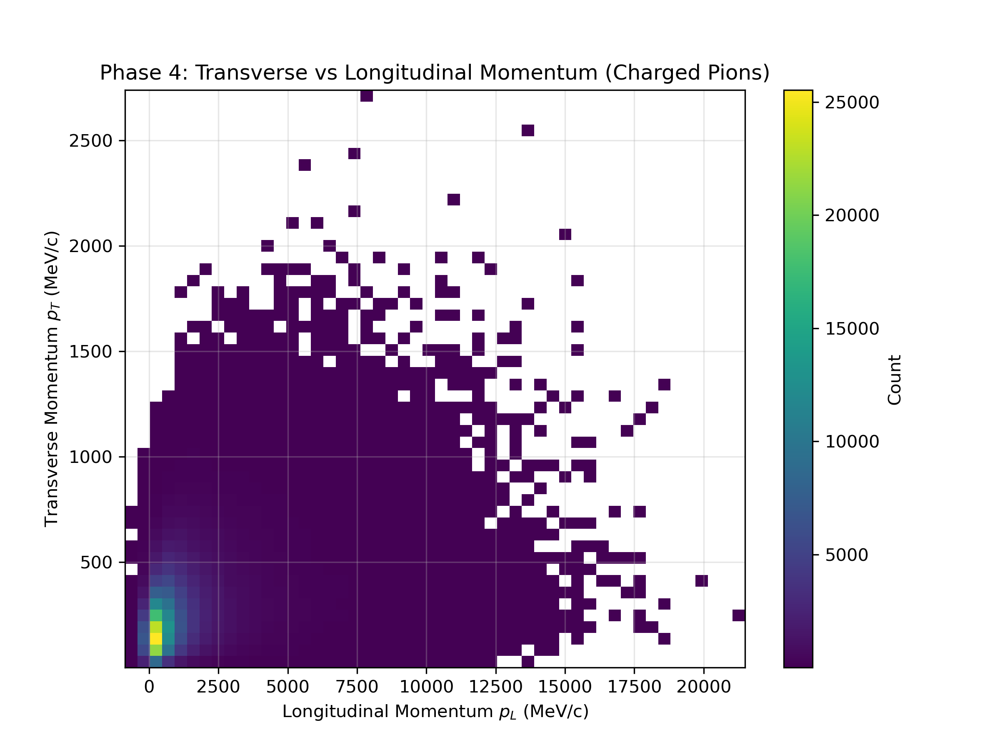
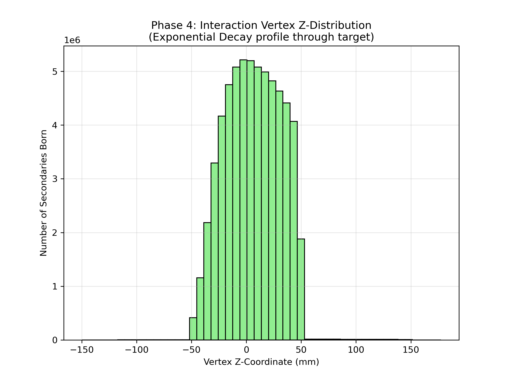

# Phenomenological Validation (Phase 4)

**Objective:** Verify that the generated particle fields mimic realistic high-energy interactions by plotting and analyzing their macroscopic shapes.

While Phases 1–3 assess the mathematical validity of the engine, Phase 4 provides phenomenological validation. A generalized framework achieves this through targeted observable plotting:

1. **Kinematic jetting ($p_T$ vs $p_L$):** Plots the 2D density distribution of transverse vs. longitudinal momentum. It ensures that high-energy collisions correctly produce forward-peaked momentum jets ($p_L \gg p_T$) characteristic of relativistic beam dynamics.
2. **Particle multiplicity:** Verifies that the histogram of generated fragments per event shapes into a physical Poisson or Negative Binomial Distribution (NBD), rather than a uniform or anomalous spread.
3. **Spectroscopic evaporation:** Evaluates scalar kinetic energy spectra (e.g., neutron distributions). It confirms the presence of dual-physical phenomena: the low-energy isotropic evaporation spike and the high-energy forward cascade tail.
4. **Spatial decay profiles:** Extracts spatial interaction vertices ($\vec{x}, \vec{y}, \vec{z}$) and demonstrates the interactions follow an exponential decay curve $\exp(-x/\lambda)$ through the target volume, conforming to the theoretical mean-free-path of the material.

---

## Results (100,000 events)

