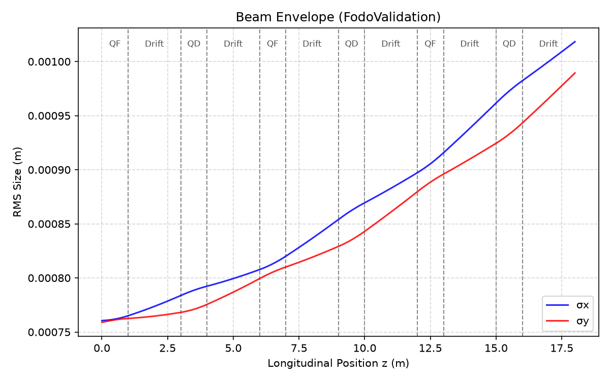
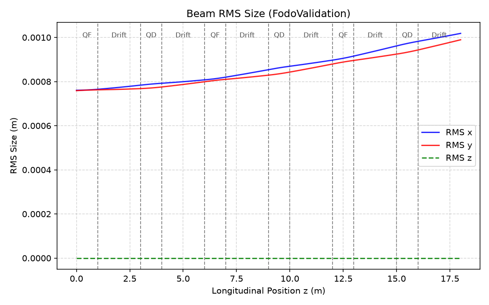
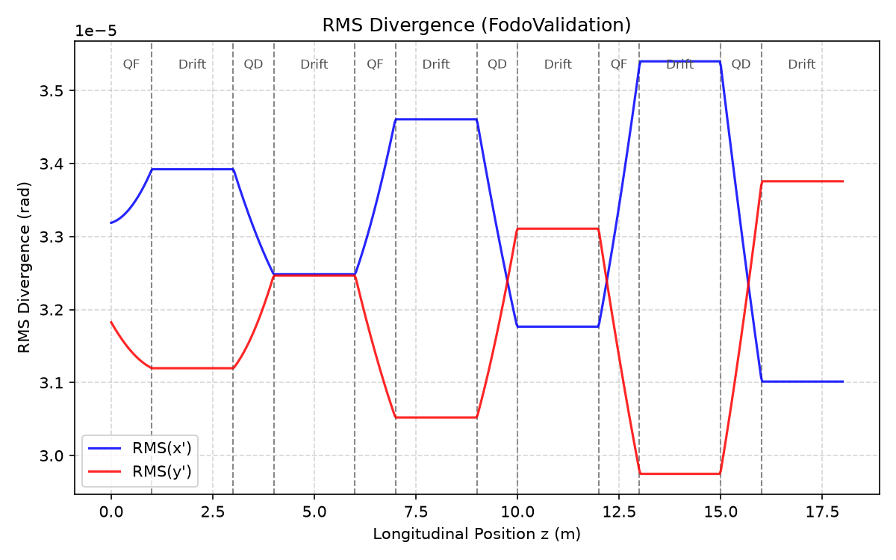
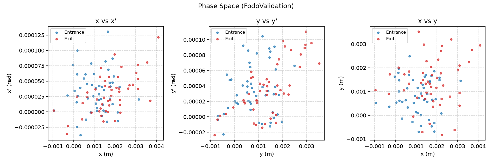
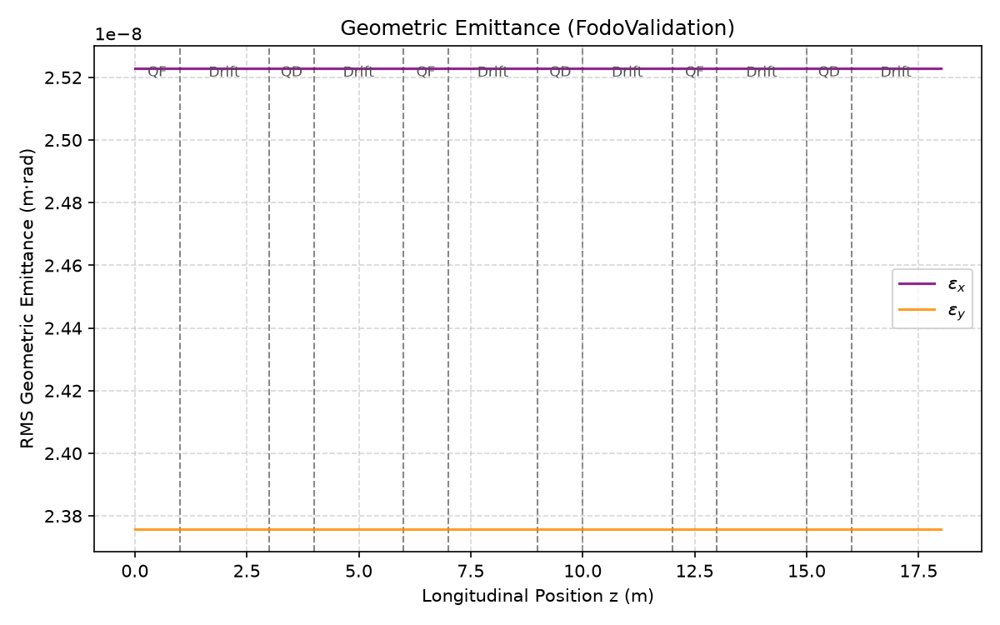
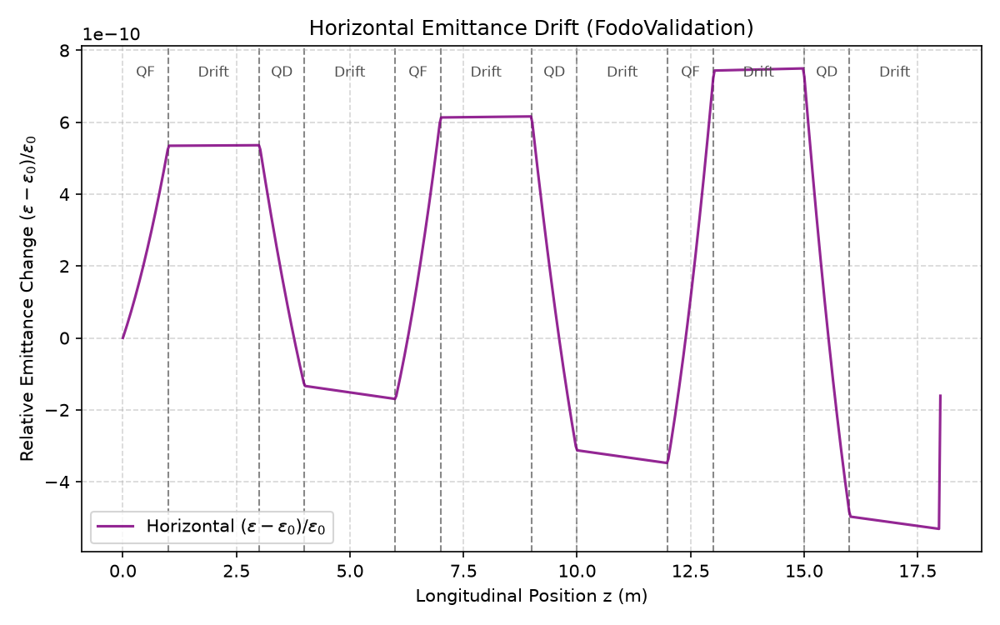
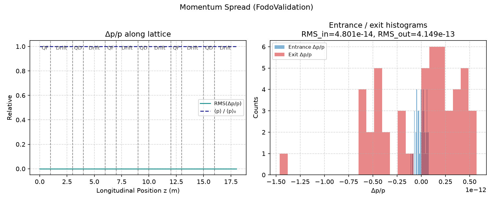
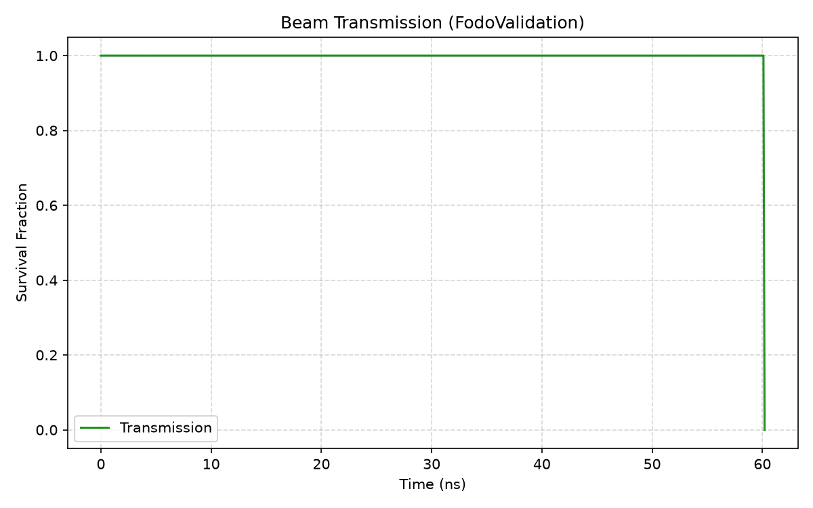
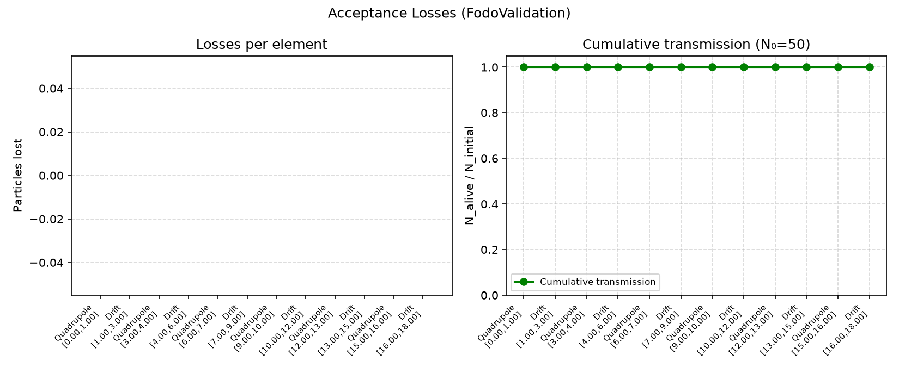

# Beam Dynamics Validation

**Goal.** Shift from individual orbits to ensemble evolution under multi-element beamlines, and verify that beam observables obey linear optics and Liouville expectations.

In ideal linear Hamiltonian transport, particle trajectories rearrange in phase space while the occupied area — the geometric emittance — remains conserved (Liouville's theorem in the transverse plane). Envelope, divergence, and Twiss parameters may oscillate; emittance should not secularly grow.

Representative diagnostics below use the FODO beam-optics validation case (Gaussian antiproton beam, alternating QF/QD cells). The same beam-optics profile is also applied to a **minimal ACOL-inspired pipeline**: an injection drift followed by FODO cells, approximating the first stage of a collector-style beamline. That case is a deliberate step toward a digital twin of the antimatter factory transport chain at CERN — not a full factory model, but a validated multi-cell precursor on which more complete lattices can build.

---

## Beam envelope

**Physical quantity.** Transverse RMS sizes $\sigma_x(z)$ and $\sigma_y(z)$.

**Expectation.** Alternating-gradient focusing produces oscillatory envelopes: each quadrupole compresses one plane and expands the other.

**Interpretation.** The measured envelopes show the classic FODO breathing pattern synchronized with QF/QD boundaries. Smooth evolution without abrupt jumps indicates correct field sampling through the lattice.

---

## Beam RMS size

**Physical quantity.** $\mathrm{RMS}(x)$, $\mathrm{RMS}(y)$, and $\mathrm{RMS}(z)$ versus longitudinal position.

**Expectation.** Transverse RMS tracks the envelope; longitudinal RMS reflects the bunch's $z$ spread and should not be driven by static magnetic optics.

**Interpretation.** Transverse RMS mirrors the envelope diagnostic. Longitudinal RMS remains a separate degree of freedom, confirming that the diagnostics distinguish planes correctly.

---

## RMS divergence

**Physical quantity.** $\mathrm{RMS}(x')$ and $\mathrm{RMS}(y')$ with $x'=p_x/p_z$.

**Expectation.** Divergence oscillates in antiphase with the envelope in each plane: a waist coincides with large angular spread.

**Interpretation.** The complementary oscillation of size and divergence is the phase-space signature of linear focusing, not of numerical diffusion.

---

## Phase-space evolution

**Physical quantity.** Transverse phase portraits $(x,x')$, $(y,y')$, and $(x,y)$ at lattice entrance and exit.

**Expectation.** Linear transport shears and rotates the distribution; the occupied area should remain comparable if emittance is conserved.

**Interpretation.** Entrance and exit clouds show the expected remapping under FODO transport. The distributions remain compact and elliptical, consistent with linear optics rather than filamentation from broken fields.

---

## Geometric emittance

**Physical quantity.** Horizontal and vertical RMS geometric emittances $\varepsilon_x$, $\varepsilon_y$, and their relative drift $(\varepsilon-\varepsilon_0)/\varepsilon_0$.

**Expectation.** Under ideal linear magnetic optics, $\varepsilon$ is an invariant of the ensemble (Liouville). Relative drift should remain far below the 5% pass threshold.

| Quantity | Result | Criterion |
|----------|--------|-----------|
| Horizontal $\varepsilon$ drift | $1.6\times10^{-10}$ | $\le 0.05$ |
| Vertical $\varepsilon$ drift | $2.5\times10^{-11}$ | $\le 0.05$ |

**Interpretation.** Absolute emittance is stable along the lattice; relative drift is consistent with zero within numerical noise. This is direct evidence that Janus preserves transverse phase-space area in multi-element transport.

---

## Momentum spread

**Physical quantity.** Ensemble $\Delta p/p$ (mean and RMS) and entrance/exit histograms.

**Expectation.** Static magnetic fields do not change $|p|$ particle-by-particle; the momentum distribution should be preserved.

**Interpretation.** Flat $\Delta p/p$ along $z$ and overlapping entrance/exit histograms confirm that magnetic transport does not alter the rigidity distribution — a prerequisite for trustworthy optics comparisons.

---

## Transmission

**Physical quantity.** $N_\mathrm{alive}/N_\mathrm{initial}$ through the lattice.

**Expectation.** For apertures large compared with the beam, transmission should remain unity.

| Quantity | Result | Criterion |
|----------|--------|-----------|
| Transmission | $100\%$ | $\ge 95\%$ |
| Particle loss | $0\%$ | $\le 5\%$ |

**Interpretation.** Full transmission shows that the FODO optics keep the beam within acceptance for this configuration; no unphysical aperture clipping is introduced by the integrator.

---

## Acceptance / losses

**Physical quantity.** Per-element loss counts and cumulative transmission.

**Expectation.** With 100% transmission, per-element losses should be zero; cumulative transmission remains flat at unity.

**Interpretation.** Empty loss histograms localize no deaths to any magnet or drift. When losses do occur in tighter apertures, the same diagnostic attributes them to the responsible element — an acceptance map for future beamline design.

---

Next: [linear optics benchmarking](optics.md).
