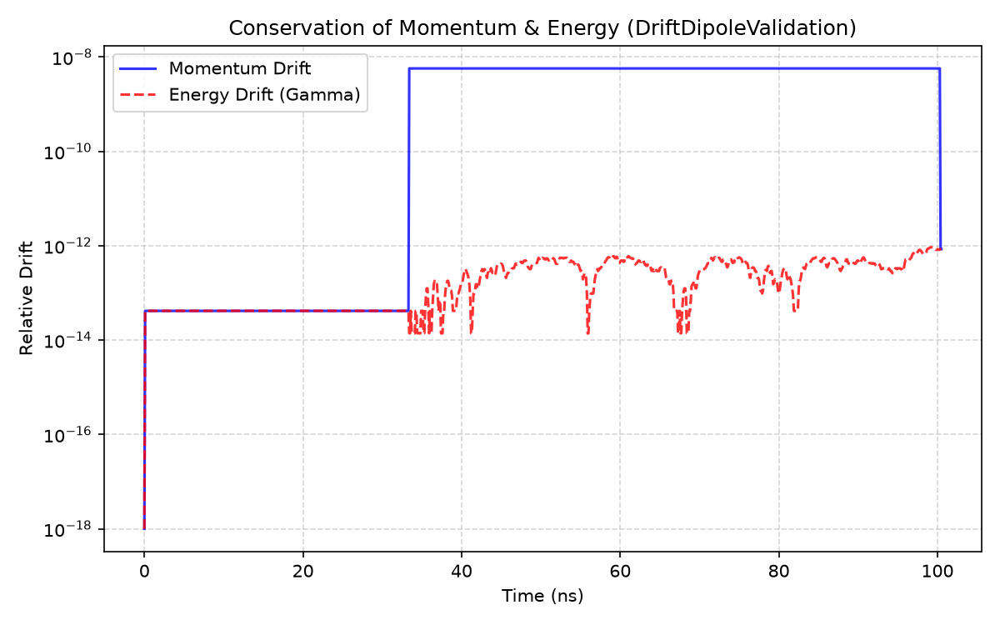
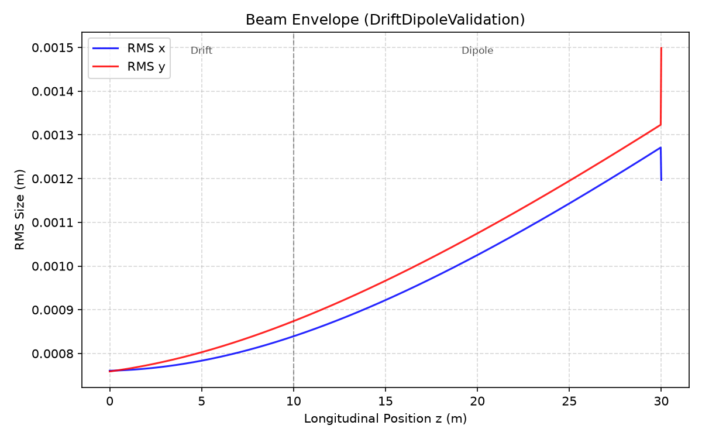
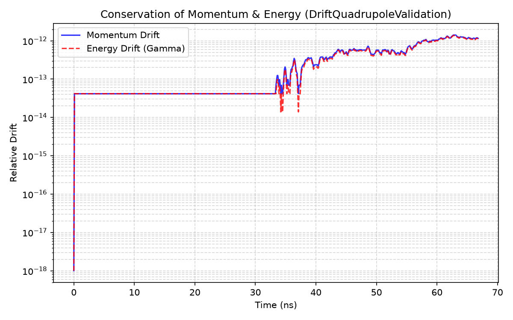
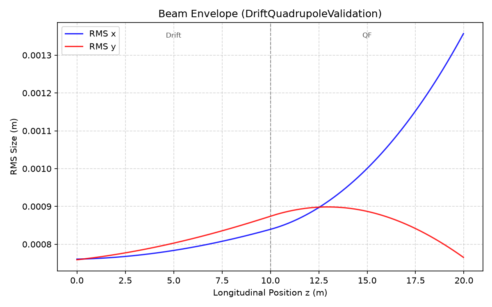

# Composite Lattice Validation

**Goal.** Demonstrate that validated elements remain physically consistent when combined: field transitions, interface continuity, and invariants survive element handoffs.

Composite lattices generally lack a single closed-form trajectory reference. Validation therefore shifts from orbit matching to **beam-quality metrics** on finite ensembles (Gaussian beams), while conservation remains a hard pass criterion.

---

## Drift → dipole

**Physical quantity.** Continuity of transport through a field-free region into a uniform bend, including envelope response and conservation across the interface.

**Expectation.** Conservation of $|p|$ and $\gamma$ must persist through the handoff. The RMS envelope should evolve smoothly; vertical geometric emittance should remain approximately conserved. Horizontal emittance is **informational** in dipole lattices because dispersion couples energy and $x$.

**Methodology.** A 50-particle Gaussian beam traverses a 5 m drift followed by a 10 m dipole ($B_y=0.5\,\mathrm{T}$). Conservation, exit-state composition, envelope, and emittance drift are recorded.

**Results.**

| Quantity | Result | Criterion |
|----------|--------|-----------|
| Momentum conservation | $5.7\times10^{-9}$ | $\le 10^{-6}$ |
| Energy conservation | $2.7\times10^{-12}$ | $\le 10^{-6}$ |
| Transmission | $100\%$ | $\ge 95\%$ |
| Vertical $\varepsilon$ drift | $1.0\times10^{-2}$ | $\le 0.05$ |

**Interpretation.** Conservation remains within tolerance across the drift–bend interface, indicating no discontinuous force artefact at the element boundary. The envelope responds to the onset of bending without numerical disruption. Bounded vertical emittance confirms that phase-space area in the non-dispersive plane is preserved through the composite.

---

## Drift → quadrupole

**Physical quantity.** Composition of free drift with linear focusing; both transverse emittances should be conserved in the absence of dispersion.

**Expectation.** Focusing compresses one transverse plane; emittance in both planes should exhibit negligible secular drift; conservation must remain at integrator precision.

**Methodology.** A Gaussian beam traverses a 2 m drift and a 1 m quadrupole. Conservation, envelope, and relative emittance drift are evaluated in both planes.

**Results.**

| Quantity | Result | Criterion |
|----------|--------|-----------|
| Momentum conservation | $2.3\times10^{-12}$ | $\le 10^{-6}$ |
| Energy conservation | $2.2\times10^{-12}$ | $\le 10^{-6}$ |
| Horizontal $\varepsilon$ drift | $5.8\times10^{-7}$ | $\le 0.05$ |
| Vertical $\varepsilon$ drift | $5.1\times10^{-7}$ | $\le 0.05$ |
| Transmission | $100\%$ | $\ge 95\%$ |

**Interpretation.** Emittance drifts at the $10^{-7}$ level show that joining a drift to a quadrupole does not inject artificial phase-space dilution. Envelope evolution matches the expected focusing response. This is the minimal successful composition test before alternating-gradient cells.

---

## Conclusion

Composite transport preserves conservation and beam quality across element interfaces. That intermediate stage is essential: multi-cell lattices only make sense once handoffs are trusted. Next: [beam dynamics validation](beam-dynamics.md).
