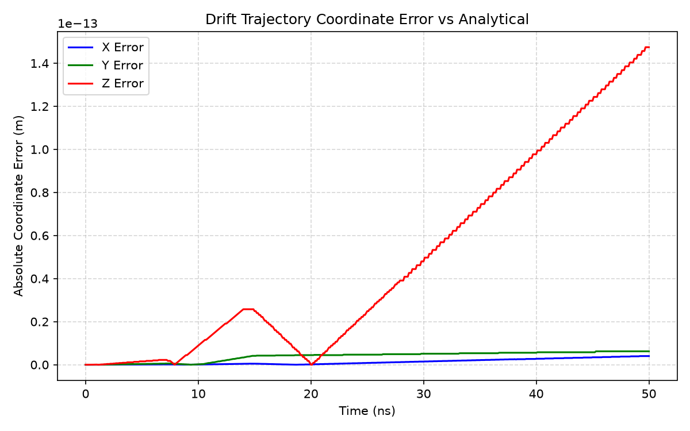
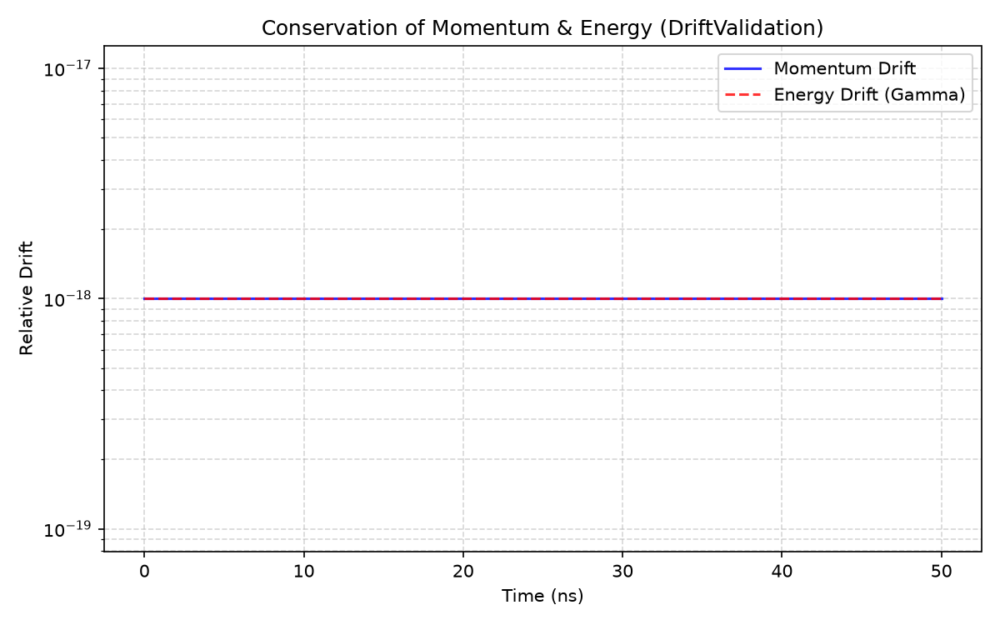
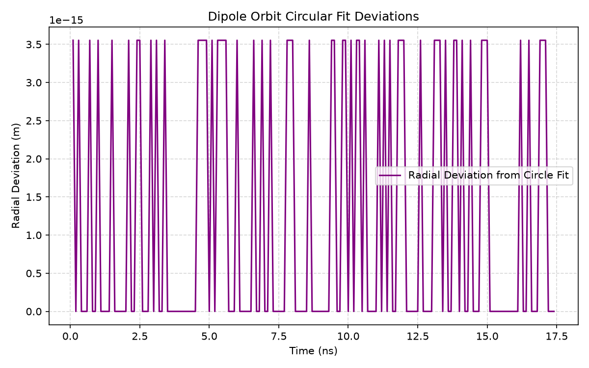
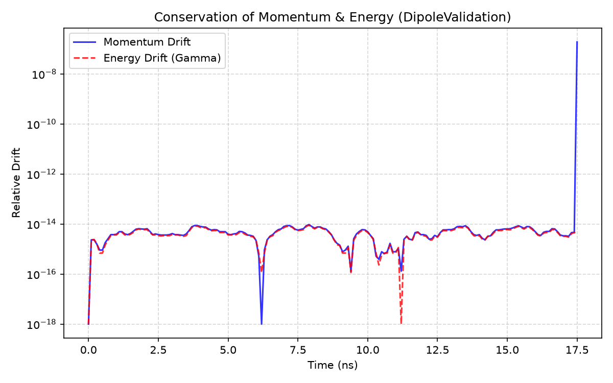
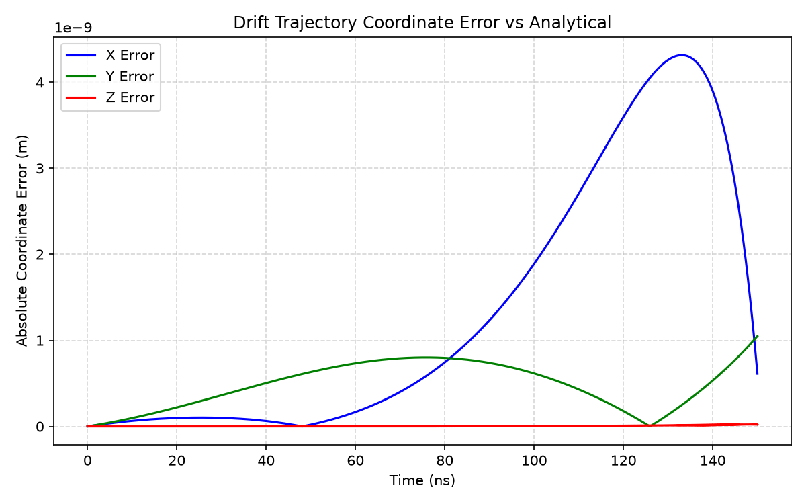
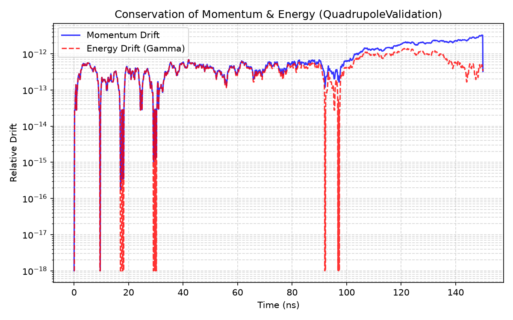
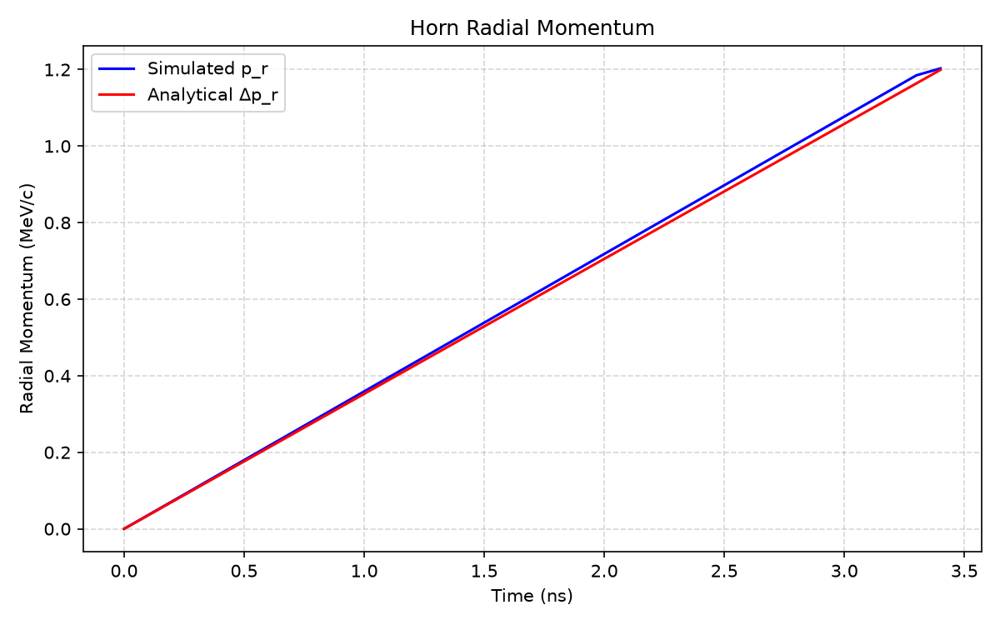
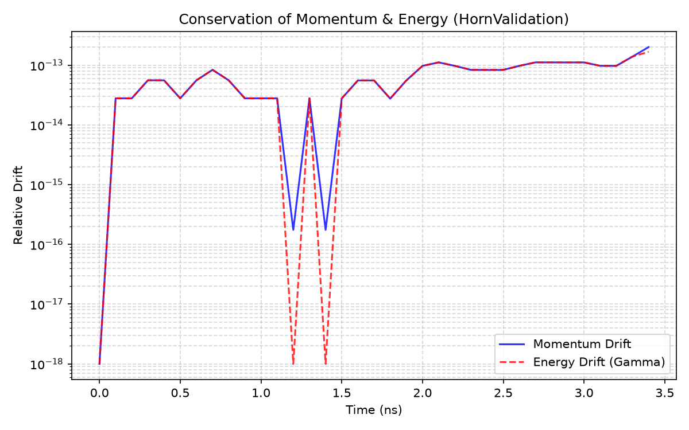
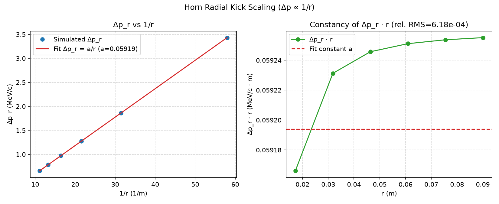

# Single-Particle Integrator Validation

**Goal.** Validate the Boris integrator and Lorentz-force implementation for isolated lattice elements against analytical or paraxial references, while monitoring relativistic conservation.

Particles obey

$$
\frac{d\mathbf{p}}{dt}=q\bigl(\mathbf{E}+\mathbf{v}\times\mathbf{B}\bigr),\qquad \mathbf{p}=\gamma m\mathbf{v}.
$$

A case passes when trajectory metrics meet declared tolerances and relative momentum and energy drifts remain below $10^{-6}$.

---

## Uniform drift

**Physical quantity.** Field-free straight-line transport: position, velocity, $|p|$, and $\gamma$.

**Expectation.** With $\mathbf{E}=\mathbf{B}=\mathbf{0}$, motion is $\mathbf{r}(t)=\mathbf{r}_0+\mathbf{v}_0 t$. Momentum and energy are exactly conserved.

**Methodology.** A single Geant4 proton is tracked through a long drift. Numerical coordinates are compared to the closed-form trajectory at every step; maximum relative $|p|$ and $\gamma$ drifts are recorded.

**Results.**

| Quantity | Result | Criterion |
|----------|--------|-----------|
| $x$ error | $4.0\times10^{-15}\,\mathrm{m}$ | $\le 10^{-6}\,\mathrm{m}$ |
| $y$ error | $6.2\times10^{-15}\,\mathrm{m}$ | $\le 10^{-6}\,\mathrm{m}$ |
| $z$ error | $1.5\times10^{-13}\,\mathrm{m}$ | $\le 10^{-6}\,\mathrm{m}$ |
| Momentum conservation | $0$ | $\le 10^{-6}$ |
| Energy conservation | $0$ | $\le 10^{-6}$ |

**Interpretation.** Coordinate errors at floating-point scale show that the integrator does not invent forces in vacuum. Flat conservation traces confirm that the Boris update introduces no spurious heating or momentum exchange. Residual $\sim10^{-13}\,\mathrm{m}$ differences are accumulation artefacts between leapfrog stepping and the closed-form reference, far below any physical tolerance.

---

## Uniform dipole

**Physical quantity.** Magnetic bending: cyclotron radius, bend angle, and the curved orbit in a uniform $B_y$.

**Expectation.** For rigidity $B\rho$ and field $B_y$,

$$
R=\frac{p_\perp}{|q|B_y},\qquad \theta=\frac{q B_y L}{p}.
$$

The orbit is a circular arc; $|p|$ and $\gamma$ remain constant in a static magnetic field.

**Methodology.** A single antiproton is tracked through a long uniform dipole. Cyclotron-radius and bend-angle errors are compared to the analytical orbit; conservation is monitored throughout.

**Results.**

| Quantity | Result | Criterion |
|----------|--------|-----------|
| Cyclotron radius error | $1.9\times10^{-7}$ | $\le 10^{-4}$ |
| Bend angle error | $4.6\times10^{-3}$ | $\le 10^{-2}$ |
| Momentum conservation | $9.5\times10^{-15}$ | $\le 10^{-6}$ |
| Energy conservation | $8.9\times10^{-15}$ | $\le 10^{-6}$ |

**Interpretation.** Sub-$10^{-6}$ radius error and machine-precision conservation demonstrate that magnetic transport is implemented correctly: the particle follows the expected Lorentz curvature without numerical energy exchange. Agreement of the bend angle within tolerance confirms that integrated deflection through a finite magnet length matches rigidity physics.

---

## Quadrupole

**Physical quantity.** Linear focusing / defocusing under $B_x=Gy$, $B_y=Gx$.

**Expectation.** Transverse motion oscillates or grows according to the signed focusing strength $\alpha=qG/B\rho$. Static magnetic fields conserve $|p|$ and $\gamma$. A paraxial analytical reference provides the expected $(x,y)$ evolution for comparison.

**Methodology.** A single antiproton is tracked through a focusing quadrupole. Coordinate errors relative to the paraxial solution, plus conservation metrics, are evaluated.

**Results.**

| Quantity | Result | Criterion |
|----------|--------|-----------|
| $x$ error | $4.3\times10^{-9}\,\mathrm{m}$ | $\le 10^{-6}\,\mathrm{m}$ |
| $y$ error | $1.0\times10^{-9}\,\mathrm{m}$ | $\le 10^{-6}\,\mathrm{m}$ |
| $z$ error | $2.5\times10^{-11}\,\mathrm{m}$ | $\le 10^{-6}\,\mathrm{m}$ |
| Momentum conservation | $3.3\times10^{-12}$ | $\le 10^{-6}$ |
| Energy conservation | $1.4\times10^{-12}$ | $\le 10^{-6}$ |

**Interpretation.** Nanometre-scale deviations from the paraxial reference are consistent with full three-dimensional Boris integration (finite $v_x$, $v_y$, and hard-edge entry), not with a broken field model. Conservation at $10^{-12}$ shows that the quadrupole applies focusing forces without numerical heating.

---

## Magnetic horn

**Physical quantity.** Azimuthal focusing field and the induced radial momentum kick $\Delta p_r$ as a function of radius.

**Expectation.** An ideal thin horn carries an axial current $I$ and produces

$$
B_\varphi=\frac{\mu_0 I}{2\pi r}.
$$

The integrated radial kick then scales as $\Delta p_r\propto 1/r$, so the product $\Delta p_r\cdot r$ is constant. Static magnetic transport still conserves $|p|$ and $\gamma$.

**Methodology.** A single particle is tracked through a magnetic horn. The radial momentum change is compared to the analytical kick from $B_\varphi(r)$. A radius sweep checks that $\Delta p_r$ versus $1/r$ is linear and that $\Delta p_r\cdot r$ is constant within tolerance. Conservation is monitored as for other single-element cases.

**Results.**

| Quantity | Result | Criterion |
|----------|--------|-----------|
| Radial momentum kick error | $1.2\times10^{-2}$ | $\le 5\times10^{-2}$ |
| $\Delta p_r$ vs $1/r$ residual | $6.2\times10^{-4}$ | $\le 5\times10^{-2}$ |
| Momentum conservation | $1.4\times10^{-13}$ | $\le 10^{-6}$ |
| Energy conservation | $1.4\times10^{-13}$ | $\le 10^{-6}$ |

**Interpretation.** Agreement of the radial kick and the $1/r$ scaling confirms that the horn field and its Lorentz deflection are implemented correctly — the characteristic collector optic of antiproton production lines. Conservation at $10^{-13}$ shows that the azimuthal $B$ field does not inject numerical energy exchange.

---

## Conclusion

Drift, dipole, quadrupole, and magnetic horn single-particle transport are validated. The integrator and elementary magnetic elements form a trustworthy base for [composite lattices](composite.md).
