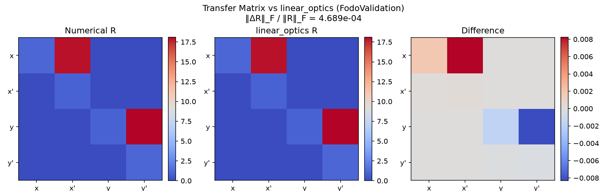
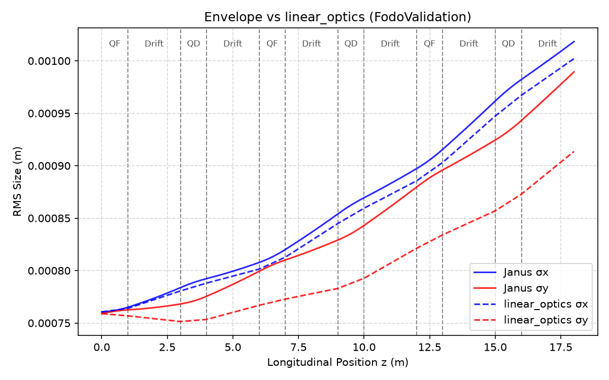
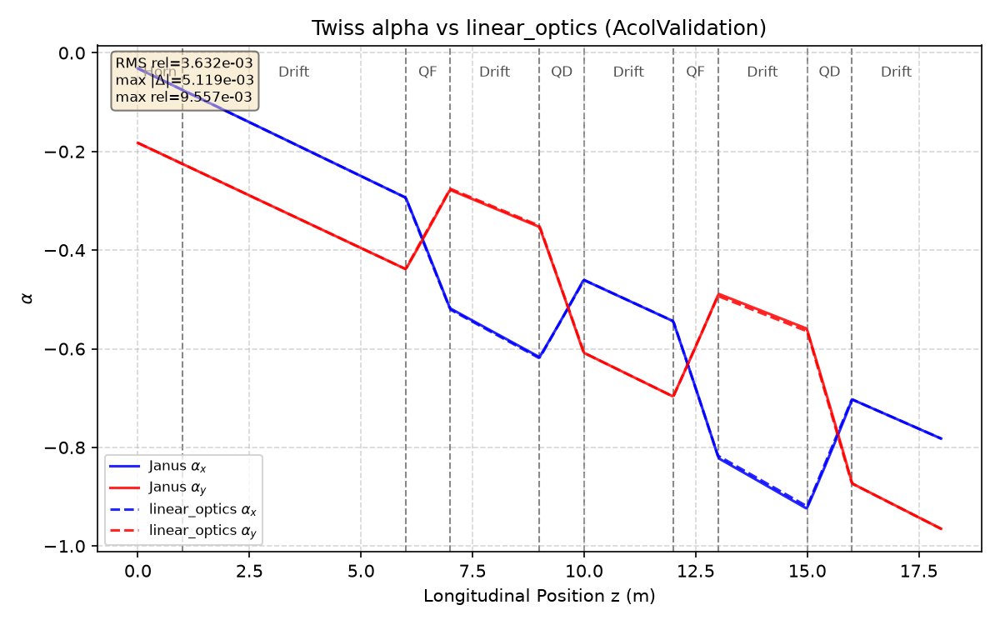
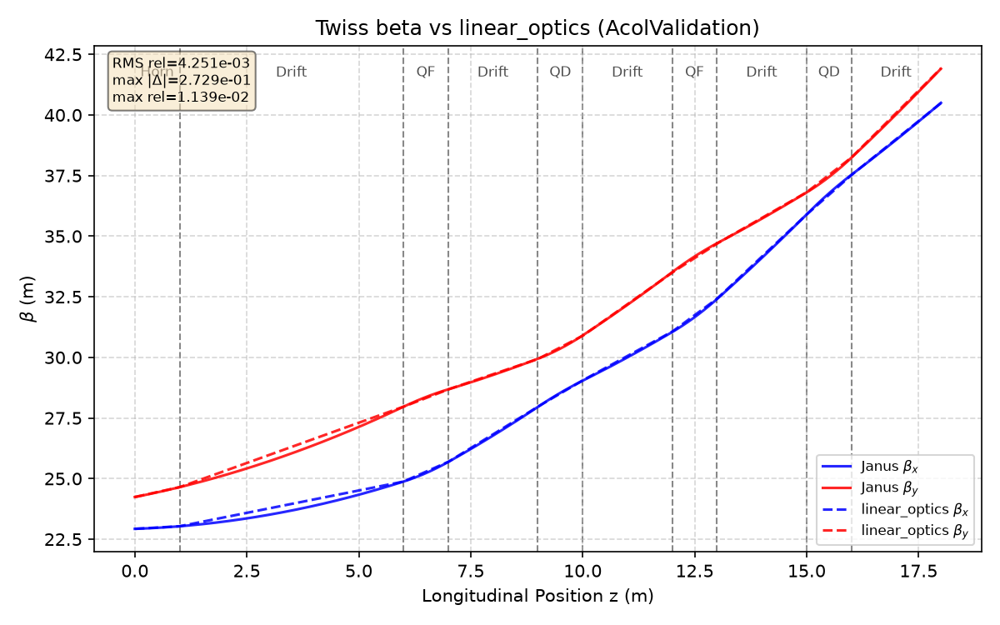
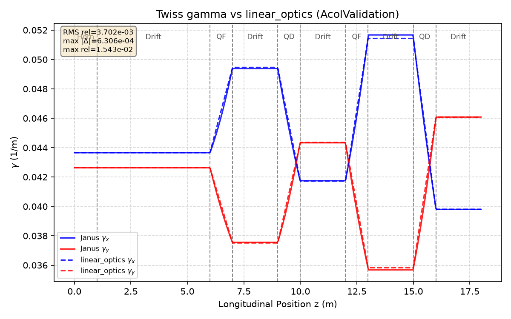

# Linear Optics Benchmarking

**Goal.** Compare Janus beam transport against an established first-order optics description.

Janus provides a modular optics backend: a built-in thick-lens linear model (Drift / Quadrupole matrices) is the default comparison target. Agreement at first order shows that particle tracking reproduces the same linear map that accelerator codes use for lattice design.

Deviations at the level of finite beam size, higher-order kinematics, and discrete timestepping are expected; the claim is consistency within numerical accuracy, not identical floating-point output.

---

## Transfer matrix comparison

**Physical quantity.** The $4\times4$ transverse transfer matrix $R=\partial X_f/\partial X_i$ with $X=(x,x',y,y')$.

**Methodology.** $R$ is estimated from tracked entrance/exit phase space by ensemble least squares and compared to the linear-optics backend. The metric is the relative Frobenius error $\|R_\mathrm{Janus}-R_\mathrm{ref}\|_F/\|R_\mathrm{ref}\|_F$.

| Quantity | Result |
|----------|--------|
| Relative Frobenius error | $4.7\times10^{-4}$ |

**Interpretation.** Sub-permille matrix agreement shows that the tracked linear map matches thick-lens optics for the FODO cell. Residual differences are consistent with finite emittance sampling and relativistic kinematics beyond the paraxial matrix model.

---

## Beam envelope comparison

**Physical quantity.** $\sigma_x(z)$ and $\sigma_y(z)$ from tracking versus linear propagation of the entrance covariance.

| Quantity | Result |
|----------|--------|
| Envelope RMS difference | $4.9\times10^{-5}\,\mathrm{m}$ |

**Interpretation.** Overlay of Janus and linear-optics envelopes confirms that collective beam size follows first-order transport. Small offsets reflect the difference between a full distribution and an uncoupled linear covariance model, not a failure of focusing.

---

## Twiss parameter comparison

**Physical quantity.** Courant–Snyder parameters $\beta_{x,y}(z)$, $\alpha_{x,y}(z)$, $\gamma_{x,y}(z)$ from the tracked RMS covariance, compared to the optics backend.

**Expectation.** In linear optics, $\beta$, $\alpha$, and $\gamma$ evolve deterministically from the entrance conditions; Janus Twiss extracted from the particle cloud should track the same curves.

| Family | RMS relative error (FODO) |
|--------|---------------------------|
| $\beta$ | $1.7\times10^{-3}$ |
| $\alpha$ | $7.1\times10^{-3}$ |
| $\gamma$ | $4.3\times10^{-3}$ |

**Interpretation.** $\alpha(z)$, $\beta(z)$, $\gamma(z)$ exhibit the periodic FODO modulation expected of matched alternating-gradient transport. Overlay with the linear backend at the $10^{-3}$ relative level validates that ensemble Twiss extraction and matrix optics describe the same lattice.

---

## Conclusion

First-order transfer maps, envelopes, and Twiss functions from Janus tracking agree with established linear beam optics within expected numerical accuracy. The comparison interface is backend-agnostic and ready for MAD-X when deployed.

Next: [summary and scope](summary.md).
