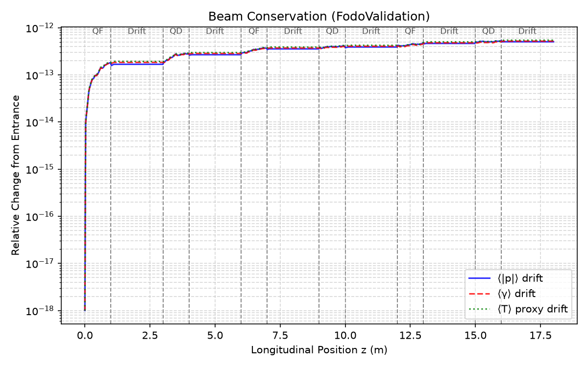

# Summary and Scope

---

## Conservation summary

Across the validation hierarchy, the same invariants are monitored so that complexity does not hide integrator failure.

| System | Momentum drift | Energy drift | $\varepsilon$ drift (non-dispersive) |
|--------|----------------|--------------|--------------------------------------|
| Drift | $0$ | $0$ | — |
| Dipole | $9.5\times10^{-15}$ | $8.9\times10^{-15}$ | — |
| Quadrupole | $3.3\times10^{-12}$ | $1.4\times10^{-12}$ | — |
| Magnetic horn | $1.4\times10^{-13}$ | $1.4\times10^{-13}$ | — |
| Drift → Dipole | $5.7\times10^{-9}$ | $2.7\times10^{-12}$ | $1.0\times10^{-2}$ (vertical) |
| Drift → Quadrupole | $2.3\times10^{-12}$ | $2.2\times10^{-12}$ | $\sim5\times10^{-7}$ |
| FODO | $2.0\times10^{-12}$ | $1.9\times10^{-12}$  | $\sim10^{-10}$ |
| ACOL | $1.2\times10^{-12}$ | $1.2\times10^{-12}$  | $\sim10^{-10}$ |



**Interpretation.** Relative drifts remain at or below the $10^{-6}$ verification threshold from single magnets through multi-cell beamlines. Emittance is preserved wherever dispersion is absent. Transmission stays complete for the validated apertures. Conservation therefore holds as system complexity increases — the necessary condition for trusting subsequent design studies.

---

## Validation scope and current limitations

### Validated

- Relativistic charged-particle motion under the Boris integrator
- Static magnetic lattice elements: drift, uniform dipole, linear quadrupole, magnetic horn (including $\Delta p_r\propto 1/r$ kick scaling)
- Composite handoffs and multi-cell FODO / minimal ACOL-inspired beamlines
- Ensemble beam diagnostics (envelope, emittance, divergence, transmission, losses)
- First-order optics consistency (transfer matrix, envelope, Twiss) against the modular linear backend

### Current modelling assumptions

- Static magnetic fields (no RF acceleration in these studies)
- Ideal hard-edge magnets
- Relativistic single-particle and ensemble transport without collective fields
- First-order (linear) beam optics for external comparison

### Outside the present scope

The following are **future extensions**, not present failures of the validated core:

- Space charge
- Scattering and material interactions
- Synchrotron radiation
- Nonlinear magnets (sextupoles, octupoles, fringe-field maps)
- Stochastic cooling and electron cooling
- Trapping and deceleration stages

Each can build on the hierarchy established here once corresponding references and diagnostics are added.

---

## Conclusions

Validation of Janus transport follows a single chain of evidence:

```text
Single-particle physics
        ↓
Composite lattice transport
        ↓
Beam dynamics
        ↓
Linear optics benchmarking
```

1. **Single-particle physics.** Drift, dipole, quadrupole, and magnetic horn trajectories — including horn radial-kick scaling — certify the Lorentz force and Boris integrator.
2. **Composite lattice transport.** Drift–dipole and drift–quadrupole assemblies preserve invariants across interfaces.
3. **Beam dynamics.** FODO ensembles exhibit the expected envelope, divergence, phase-space, emittance, momentum-spread, and transmission behaviour, consistent with Liouville's theorem in linear optics. The minimal ACOL-inspired pipeline extends the same diagnostics to a collector-style multi-cell layout as an early digital-twin stepping stone for CERN antimatter transport.
4. **Linear optics benchmarking.** Transfer matrices, envelopes, and Twiss parameters agree with established first-order optics within numerical accuracy.

Together these results establish a reliable computational foundation for future optimization and for extension toward complete antimatter transport, deceleration, cooling, trapping, and ultimately a digital twin of the antimatter factory transport pipeline.
